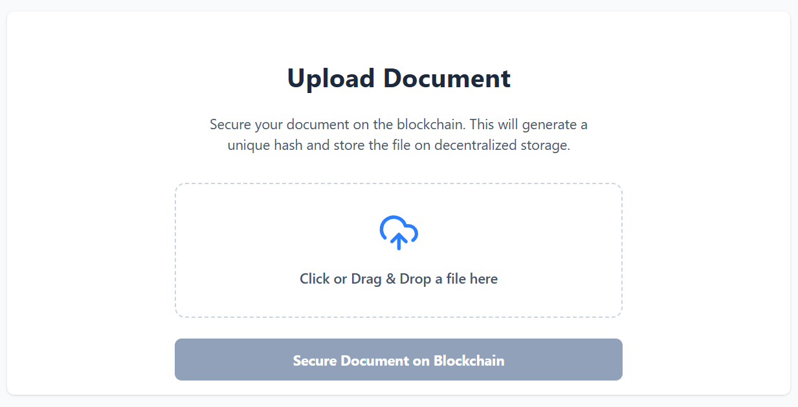
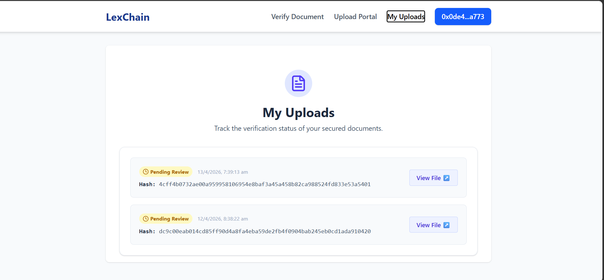
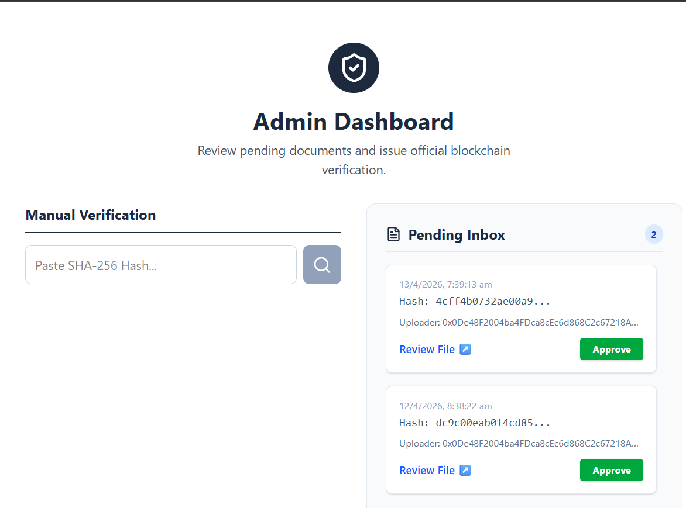
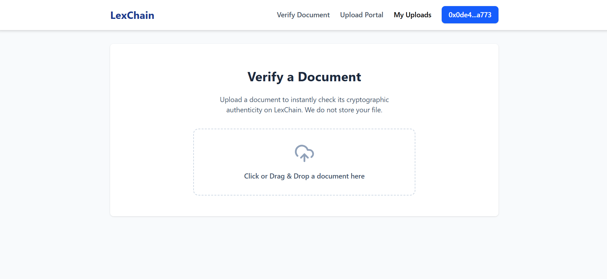
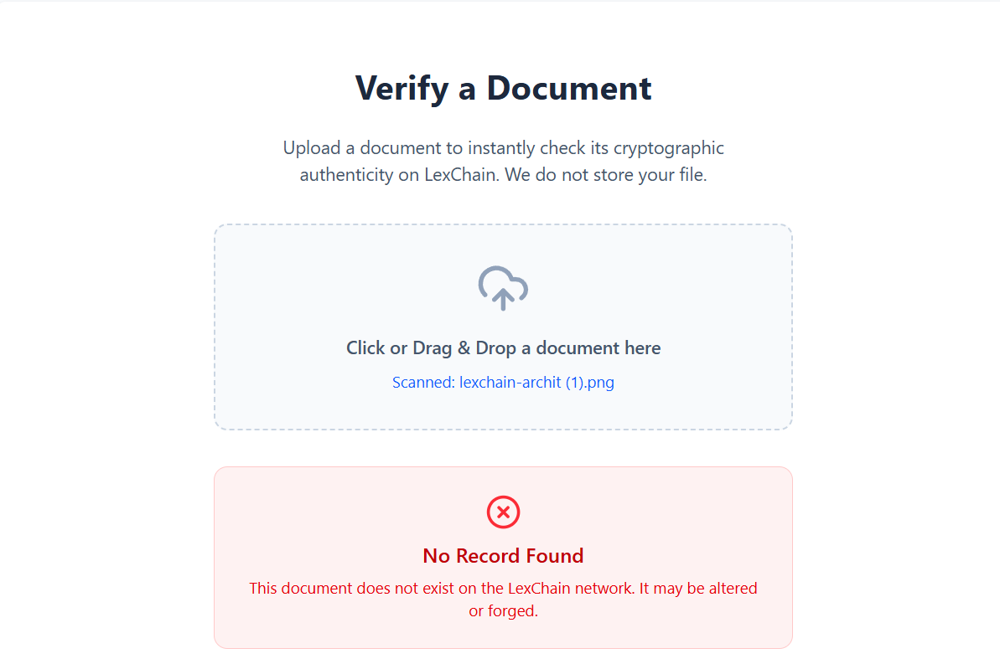

# 🔗 LexChain

A decentralized application (dApp) featuring a decoupled architecture. The client-side handles direct Web3 interactions, while a dedicated Node.js backend indexes and tracks blockchain transaction hashes for optimized querying.

Developed by Anurag Pandey (B.Tech, Computer Science and Engineering).

---

## ✨ Features & Visual Walkthrough

LexChain provides a seamless, secure interface for document verification and storage on the blockchain.

### 📤 Upload & Secure Documents
Users can easily drag and drop files to secure them. This generates a unique cryptographic hash and stores the document on decentralized storage.


### 👤 User Dashboard (My Uploads)
Keep track of all secured documents in one place. The dashboard displays the verification status (e.g., Pending Review) and the unique transaction hashes for each file.


### 🛡️ Admin Dashboard
A dedicated portal for administrators to manually verify SHA-256 hashes, review pending documents from the inbox, and issue official blockchain approvals.


### 🔍 Instant Document Verification
Anyone can upload a document to instantly check its cryptographic authenticity on the LexChain network without the file itself being stored.


If a document has been altered, forged, or doesn't exist on the network, the system immediately flags it to ensure complete trust and transparency.


---

## 🏗 Project Structure

This project is divided into two specialized environments:

- `/frontend` - The user interface and direct blockchain/Web3 connection layer. Handles user wallet connections and smart contract execution.
- `/backend` - A Node.js service dedicated strictly to listening, indexing, and storing blockchain transaction hashes for fast data retrieval.

## 🚀 Prerequisites

Before you begin, ensure you have the following installed:
- [Node.js](https://nodejs.org/) (v16 or higher recommended)
- npm or yarn
- A Web3 wallet browser extension (e.g., MetaMask)

## 🛠 Installation & Setup

### 1. Clone the repository
```bash
git clone [https://github.com/anuragpandey4/LexChain.git](https://github.com/anuragpandey4/LexChain.git)
cd LexChain